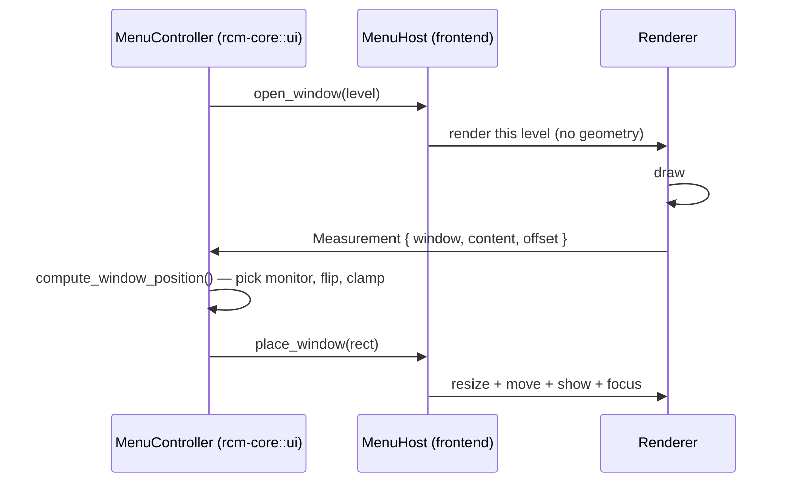

# rcm-reactor

The RCM context-menu engine rebuilt on native Windows UI — an alternative frontend to
[`rcm-tauri`](../rcm-tauri) ([repository](https://github.com/ahaoboy/rcm-tauri)).

- **[`windows-reactor`](../../windows-rs/crates/libs/reactor)** — declarative WinUI 3 in Rust
  (replaces the Tauri WebView + React frontend)
- **[`tray-icon`](https://crates.io/crates/tray-icon)** — system tray (replaces `tauri`'s tray)
- **[`windows`](https://crates.io/crates/windows)** — the little Win32 needed to make Reactor
  windows behave like native popup menus

All system behaviour is shared with `rcm-tauri` through `rcm-core`, `rcm-vm`, `rcm-com` and
`rcm-reg` — including the layout engine, so both builds place menus identically and differ only in
how they draw them.

```sh
cargo run -p rcm-reactor
```

|              | [`rcm-tauri`](../rcm-tauri)              | `rcm-reactor`                                 |
| ------------ | ---------------------------------------- | --------------------------------------------- |
| UI           | WebView + React                          | native WinUI 3                                |
| Menu windows | one WebView per level, pooled and reused | one native popup per level, created on demand |
| Tray         | `tauri`                                  | `tray-icon` + `muda`                          |

## Deliberately out of scope

These depend on WebView/CSS features WinUI does not have, and are only kept so the surrounding
workflow is unchanged:

- **`style.css`** — Reactor renders native WinUI controls, so the stylesheet does not affect the
  UI. It is still written next to the executable and can still be pulled/edited, keeping the
  config-editor and remote-sync workflow identical.
- **CSS layout and animation** — replaced by fixed metrics in `rcm-reactor/src/metrics.rs`.
- **WebView2 warm-up window** — no WebView in this build.

## Architecture

Rust owns every layout decision; the frontend only draws and measures.

| Concern                                            | Owner          |
| -------------------------------------------------- | -------------- |
| Which level is displayed                           | `rcm_core::ui` |
| Where each window goes (monitor pick, flip, clamp) | `rcm_core::ui` |
| Hover / click-away / auto-hide policy              | `rcm_core::ui` |
| Drawing a level                                    | frontend       |
| Measuring the drawn content                        | frontend       |
| Moving / resizing / focusing a native window       | frontend       |

The frontend's only geometry output is a `Measurement` — how large it drew a level. It never
computes a position, and Rust never sends one. The logic lives in `rcm-core` (`ui/` for layout,
plus `actions`, `files`, `monitor`, `style`, `runner`) so the two frontends cannot drift apart.

### Two-phase host contract

`MenuHost` splits showing a level into two steps, which is what lets Rust own placement while the
frontend owns drawing and measuring:

1. **`open_window`** — create or reuse the window and tell the frontend to render the level.
   _No geometry applied._
2. **`place_window`** — apply the final rectangle, reveal and focus.



Both frontends implement the same contract, differing only in how they address and reveal a
window:

|              | Reactor                 | Tauri                         |
| ------------ | ----------------------- | ----------------------------- |
| `MenuHost`   | `menu_runtime.rs`       | `menu_host.rs`                |
| Window key   | `HWND` (`isize`)        | window label (`&'static str`) |
| Render event | component `open_window` | `menu-show` emit              |
| Measurement  | `observe_composition_host` | `menu-measured` emit       |

### Measuring content

Reactor has no general measurement API, but `observe_composition_host` on an `ElementRef<Grid>`
reports the bound grid's real `ActualWidth` / `ActualHeight` and re-reports on every WinUI
`SizeChanged`. That gives the laid-out content size.

- The root grid is `Left`/`Top` aligned with a width clamp, so its width _is_ the menu's natural
  width.
- Row grids use an `Auto` label column plus an empty `Star` spacer before the arrow: `Auto` keeps
  the measurable natural width, and `Star` absorbs the slack once the window matches it, pinning
  the arrow to the right edge.
- Only the **first** measurement is applied — resizing emits another event, which would otherwise
  oscillate.
- The position is applied always, the size only once measured.

> **Caveat:** `observe_composition_host` is documented as observing an _application-owned lifted
> Composition host_, not as general layout measurement. It works because it reports
> `IFrameworkElement` metrics, but that can change without notice. If no measurement arrives the
> popup still opens, sized from the local estimate.

### Why Win32 is still used

Reactor exposes neither window position nor window visibility, and the menu needs a borderless,
always-on-top popup at the cursor. `win32.rs` applies `WS_POPUP`, clears the caption, sets
`WS_EX_TOOLWINDOW | WS_EX_TOPMOST`, and calls `SetWindowPos` / `PostMessageW(WM_CLOSE)`.

It is also where the popup is made the **foreground window**. The right-click is captured in
Explorer by the shell extension and forwarded over a pipe, so our process never received the input
event Windows requires before honouring `SetForegroundWindow`; `force_foreground` temporarily
attaches our input queue to the current foreground thread (`AttachThreadInput`) to lift that
restriction.

### Dismissal

Dismissal is a live focus query, not blur events: only asking the OS can tell "focus moved between
our own windows" (normal — a parent hands it to the submenu it just opened) from "focus left the
menu". The menu closes once the foreground has been "not ours" on two consecutive polls, or after
30 s without interaction.

### Hover highlight

Each row is a `Border` with a transparent-but-non-null `Background` — WinUI requires that for the
element to take part in hit testing — and the row under the pointer swaps to a translucent neutral
grey (`MENU_HOVER_ARGB`). A neutral grey reads as a highlight on both light and dark surfaces,
unlike WinUI's `CardStroke`, which is nearly invisible on dark.

### Popup lifecycle

1. `monitor.rs` receives a right-click, classifies it with `rcm_core::monitor`, builds the menu via
   `rcm-vm`, and pushes `AppEvent::ShowMenu`.
2. `RcmApp` drains the queue on a timer and calls `menu_runtime::show_root`, which asks the
   controller for the level and opens it with `ComponentContext::open_window`.
3. `MenuWindow` schedules a one-shot `ComponentTimer` (the handle is stored — dropping a
   `ComponentTimer` cancels it) whose `run_window` call learns the `HWND`, strips the chrome and
   places the window at the estimated size.
4. The renderer reports its real size; the controller re-clamps and Reactor applies the final
   rectangle and focuses the window.
5. Hovering a row with children reports it to the controller, which positions the child from the
   parent's stored rectangle; clicking a leaf runs the command through `rcm-core::runner`.
6. The timer poll dismisses everything when focus leaves, or after the auto-hide timeout.
